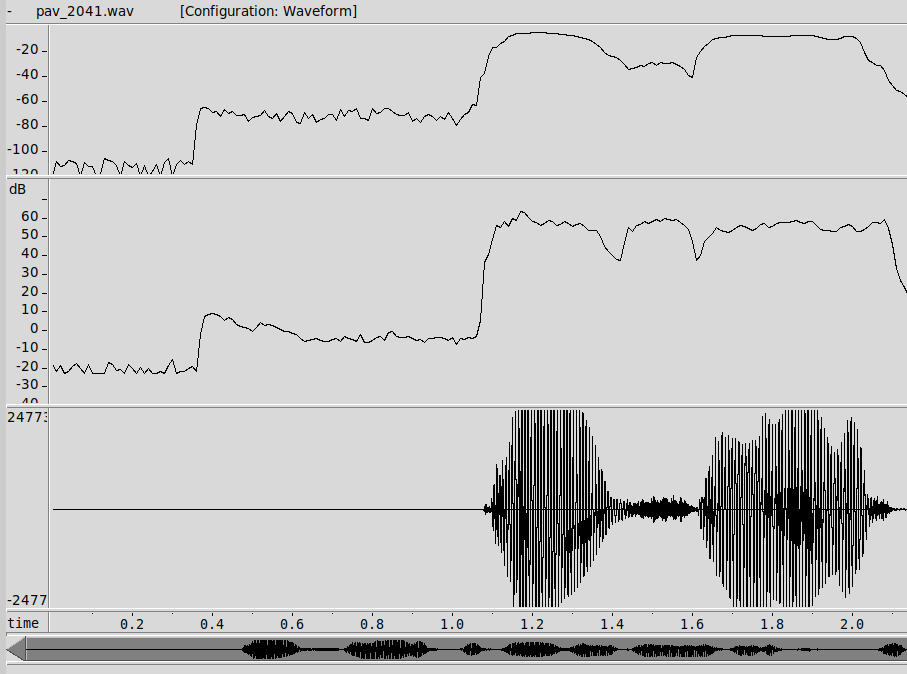
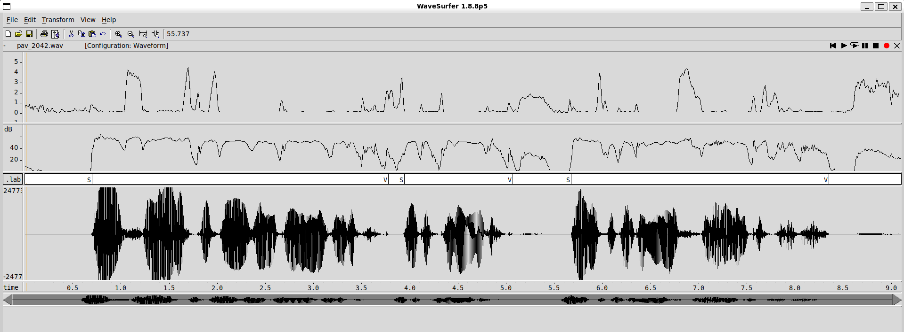
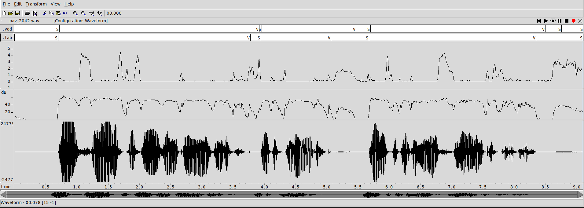
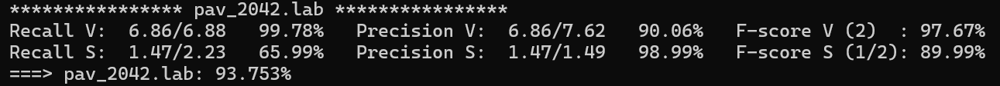
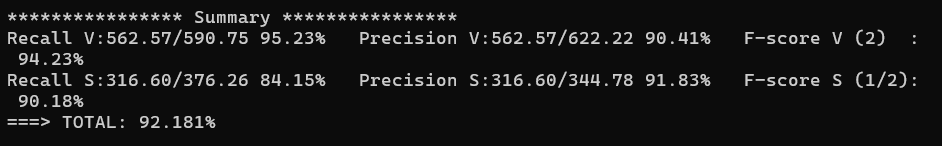
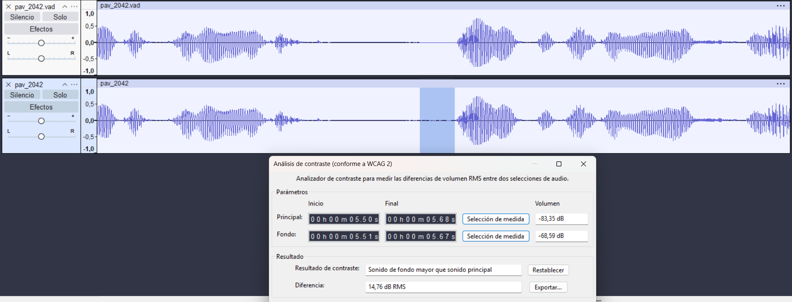
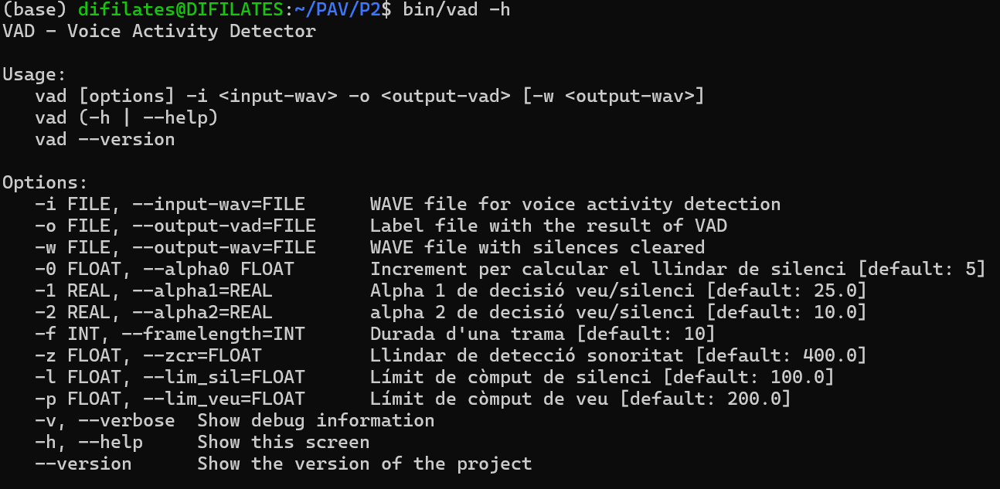
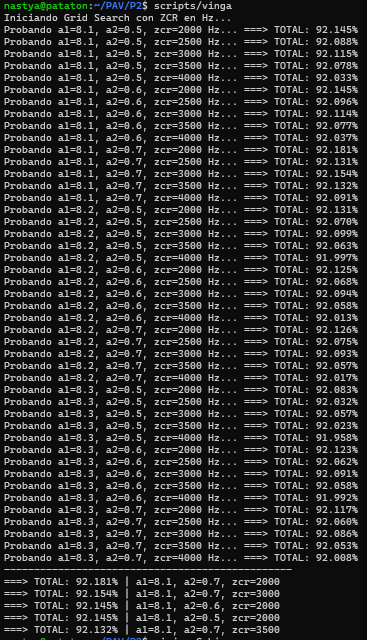

PAV - P2: detección de actividad vocal (VAD)
============================================

Esta práctica se distribuye a través del repositorio GitHub [Práctica 2](https://github.com/albino-pav/P2),
y una parte de su gestión se realizará mediante esta web de trabajo colaborativo.  Al contrario que Git,
GitHub se gestiona completamente desde un entorno gráfico bastante intuitivo. Además, está razonablemente
documentado, tanto internamente, mediante sus [Guías de GitHub](https://guides.github.com/), como
externamente, mediante infinidad de tutoriales, guías y vídeos disponibles gratuitamente en internet.


Inicialización del repositorio de la práctica.
----------------------------------------------

Para cargar los ficheros en su ordenador personal debe seguir los pasos siguientes:

*  Abra una cuenta GitHub para gestionar esta y el resto de prácticas del curso.
*  Cree un repositorio GitHub con el contenido inicial de la práctica (sólo debe hacerlo uno de los
  integrantes del grupo de laboratorio, cuya página GitHub actuará de repositorio central del grupo):
  -  Acceda la página de la [Práctica 2](https://github.com/albino-pav/P2).
  -  En la parte superior derecha encontrará el botón **`Fork`**. Apriételo y, después de unos segundos,
    se creará en su cuenta GitHub un proyecto con el mismo nombre (**P2**). Si ya tuviera uno con ese 
    nombre, se utilizará el nombre **P2-1**, y así sucesivamente.
*  Habilite al resto de miembros del grupo como *colaboradores* del proyecto; de este modo, podrán
  subir sus modificaciones al repositorio central:
  -  En la página principal del repositorio, en la pestaña **:gear:`Settings`**, escoja la opción 
    **Collaborators** y añada a su compañero de prácticas.
  -  Éste recibirá un email solicitándole confirmación. Una vez confirmado, tanto él como el
    propietario podrán gestionar el repositorio, por ejemplo: crear ramas en él o subir las
    modificaciones de su directorio local de trabajo al repositorio GitHub.
*  En la página principal del repositorio, localice el botón **Branch: master** y úselo para crear
  una rama nueva con los primeros apellidos de los integrantes del equipo de prácticas separados por
  guion (**fulano-mengano**).
*  Todos los miembros del grupo deben realizar su copia local en su ordenador personal.
  -  Copie la dirección de su copia del repositorio apretando en el botón **Clone or download**.
    Asegúrese de usar *Clone with HTTPS*.
  -  Abra una sesión de Bash en su ordenador personal y vaya al directorio **PAV**. Desde ahí, ejecute:

    ```.sh
    git clone dirección-del-fork-de-la-práctica
    ```

  -  Vaya al directorio de la práctica `cd P2`.

  -  Cambie a la rama **fulano-mengano** con la orden:

    ```.sh
    git checkout fulano-mengano
    ```

*  A partir de este momento, todos los miembros del grupo de prácticas pueden trabajar en su directorio
  local del modo habitual, usando el repositorio remoto en GitHub como repositorio central para el trabajo colaborativo
  de los distintos miembros del grupo de prácticas o como copia de seguridad.
  -  Puede *confirmar* versiones del proyecto en su directorio local con las órdenes siguientes:

    ```.sh
    git add .
    git commit -m "Mensaje del commit"
    ```

  -  Las versiones confirmadas, y sólo ellas, se almacenan en el repositorio y pueden ser accedidas en cualquier momento.

*  Para interactuar con el contenido remoto en GitHub es necesario que los cambios en el directorio local estén confirmados.

  -  Puede comprobar si el directorio está *limpio* (es decir, si la versión actual está confirmada) usando el comando
    `git status`.

  -  La versión actual del directorio local se sube al repositorio remoto con la orden:

    ```.sh
    git push
    ```

    *  Si el repositorio remoto contiene cambios no presentes en el directorio local, `git` puede negarse
      a subir el nuevo contenido.

      -  En ese caso, lo primero que deberemos hacer es incorporar los cambios presentes en el repositorio
        GitHub con la orden `git pull`.

      -  Es posible que, al hacer el `git pull` aparezcan *conflictos*; es decir, ficheros que se han modificado
        tanto en el directorio local como en el repositorio GitHub y que `git` no sabe cómo combinar.

      -  Los conflictos aparecen marcados con cadenas del estilo `>>>>`, `<<<<` y `====`. Los ficheros correspondientes
        deben ser editados para decidir qué versión preferimos conservar. Un editor avanzado, del estilo de Microsoft
        Visual Studio Code, puede resultar muy útil para localizar los conflictos y resolverlos.

      -  Tras resolver los conflictos, se ha de confirmar los cambios con `git commit` y ya estaremos en condiciones
        de subir la nueva versión a GitHub con el comando `git push`.


  -  Para bajar al directorio local el contenido del repositorio GitHub hay que ejecutar la orden:

    ```.sh
    git pull
    ```
  
    *  Si el repositorio local contiene cambios no presentes en el directorio remoto, `git` puede negarse a bajar
      el contenido de este último.

      -  La resolución de los posibles conflictos se realiza como se explica más arriba para
        la subida del contenido local con el comando `git push`.


*  Al final de la práctica, la rama **fulano-mengano** del repositorio GitHub servirá para remitir la
  práctica para su evaluación utilizando el mecanismo *pull request*.
  -  Vaya a la página principal de la copia del repositorio y asegúrese de estar en la rama
    **fulano-mengano**.
  -  Pulse en el botón **New pull request**, y siga las instrucciones de GitHub.


Entrega de la práctica.
-----------------------

Responda, en este mismo documento (README.md), los ejercicios indicados a continuación. Este documento es
un fichero de texto escrito con un formato denominado _**markdown**_. La principal característica de este
formato es que, manteniendo la legibilidad cuando se visualiza con herramientas en modo texto (`more`,
`less`, editores varios, ...), permite amplias posibilidades de visualización con formato en una amplia
gama de aplicaciones; muy notablemente, **GitHub**, **Doxygen** y **Facebook** (ciertamente, :eyes:).

En GitHub. cuando existe un fichero denominado README.md en el directorio raíz de un repositorio, se
interpreta y muestra al entrar en el repositorio.

Debe redactar las respuestas a los ejercicios usando Markdown. Puede encontrar información acerca de su
sintáxis en la página web [Sintaxis de Markdown](https://daringfireball.net/projects/markdown/syntax).
También puede consultar el documento adjunto [MARKDOWN.md](MARKDOWN.md), en el que se enumeran los
elementos más relevantes para completar la redacción de esta práctica.

Recuerde realizar el *pull request* una vez completada la práctica.

Ejercicios
----------

### Etiquetado manual de los segmentos de voz y silencio

- Grabe una señal de voz en la que haya distintos segmentos de voz y silencio. La señal debe ser de un
  solo canal (monofónica), grabada con una frecuencia de muestreo de 16 kHz y codificada con PCM lineal
  de 16 bits.

  Nombre a la señal como `pav_GGP#.wav`, donde GG es el grupo de clase (por ejemplo, 21 o 41), P es el
  número del puesto de trabajo y # es el número de señal (si sólo se entrega una señal, este número es
  1).

  > NOTA: es habitual que las grabaciones empiecen con un segmento de silencio de potencia extremadamente
  > bajo; mucho más bajo que el nivel de ruido normal durante el resto de la señal. Si esto ocurre, la
  > detección usando como nivel de referencia para el silencio el segmento inicial se ve seriamente
  > dificultada. Puede detectar esta situación visualizando el nivel de potencia estimado por el propio
  > `wavesurfer` y corregirla usando la herramienta de corte (:scissors:).

 

 ***La nostra grabació començava per un segment de silenci més extrem. De forma que hem corregit aquesta situació
  eliminat aquest tram de 0 a 0.4s, per evitar possibles errors.***

- Etiquete manualmente los segmentos de voz y silencio del fichero grabado al efecto. Inserte, a
  continuación, una captura de `wavesurfer` en la que se vea con claridad la señal temporal, el contorno de
  potencia y la tasa de cruces por cero, junto con el etiquetado manual de los segmentos.

 

 
- A la vista de la gráfica, indique qué valores considera adecuados para las magnitudes siguientes:

  * Incremento del nivel potencia en dB, respecto al nivel correspondiente al silencio inicial, para
    estar seguros de que un segmento de señal se corresponde con voz.

    ***Observem com el silenci incial es troba en aproximadament -5dB i passa a 60dB en pic comença la parla real.
    Això correspon a un increment del nivell de potència inicial de 55dB. Durant la resta de la gravació la variació
    dels segments de veu és troba aproximadament entre els valors de 25 i 65dB. Per tant, per sobre dels 25dB, un increment
    de 20dB pod considerar-se un umbral adequat per identificar un segment de veu amb seguretat.***


  * Duración mínima razonable de los segmentos de voz y silencio.

    ***A partir de la visualització de la nostra grabació, la duració mínima raonable pels segments de veu és de 200-300ms
    i pels segments de silenci 100ms. D'aquesta forma intentarem evitar errors de classificació i assegurar-nos la detecció
    d'un só de parla real i assegurar que no és un cop breu, juntament a la detecció de silencis reals per evitar el tall
    de paraules i frases.***

  * ¿Es capaz de sacar alguna conclusión a partir de la evolución de la tasa de cruces por cero?

     ***A partir de la comparació entre la potència i la ZCR en el nostre gràfic, podem concloure:***
    
    ***- Identificació de sons sords: La ZCR ens permet detectar segments de parla amb poca energia però
      alta freqüència, com les consonants fricatives (pels pics elevats de ZCR), que la potència per si
      sola podria classificar erròniament com a silenci.***
    
    ***- Precisió en els extrems de la parla: La ZCR actua com un excel·lent indicador dels inicis i finals
      de paraula. Hem observat que la ZCR sovint s'activa abans que la potència arribi al seu llindar,
      ajudant a no "menjar-se" les primeres consonants de cada frase.***
    
    ***- Discriminació de soroll i pauses: En els segments de silenci real, la ZCR es manté baixa i estable.
      Això ens ajuda a diferenciar les pauses breus entre paraules (on la ZCR fluctua) del silenci absolut,
      evitant talls innecessaris en la detecció.***
    
    ***- Complementarietat: Mentre la potència defineix el "cos" de la veu (vocals), la ZCR defineix la naturalesa
      del so (sord vs sonor), essent una eina de guarda fonamental per ajustar els llindars de decisió del VAD.***
 


### Desarrollo del detector de actividad vocal

- Complete el código de los ficheros de la práctica para implementar un detector de actividad vocal en
  tiempo real tan exacto como sea posible. Tome como objetivo la maximización de la puntuación-F `TOTAL`.

***Per maximitzar l'F-score TOTAL, hem millorat el detector bàsic afegint noves característiques i una màquina d'estats més robusta:***

***Ús del ZCR: Com que els fonemes sords o fricatius (com /s/ o /f/) tenen poca energia, incorporem ZCR per detectar-los i reduir els falsos negatius.***

***Doble llindar (Histeresi amb alpha1 i alpha2): Apliquem un llindar alt d'activació per començar a detectar veu, però un de més baix per mantenir-la. Això evita que petites caigudes d'energia tallin la detecció.***

***Marge de silenci (lim_sil): S'introdueix l'estat ST_MAYBE_SILENCE. El silenci només es confirma si la caiguda d'energia es manté un temps mínim, evitant partir paraules a causa de les pauses naturals de la parla (ex: abans d'una /p/).***

***Filtratge de sorolls curts (lim_veu): Amb l'estat ST_MAYBE_VOICE, exigim que l'activitat acústica duri un temps mínim abans de classificar-la com a veu. Això filtra sorolls breus o cops aïllats (millorant la Precision).***


- Inserte una gráfica en la que se vea con claridad la señal temporal, el etiquetado manual y la detección
  automática conseguida para el fichero grabado al efecto.

    

    

- Explique, si existen. las discrepancias entre el etiquetado manual y la detección automática.

***Tot i les millores introduïdes encara s'aprecien petites diferències naturals.***
***Retard en l'activació (Biaix inicial): Les etiquetes de veu automàtiques comencen lleugerament més tard que les manuals. Això es deu al temps de confirmació necessari (paràmetre -p) perquè l'algoritme asseguri que l'increment d'energia no és un soroll transitori.***

***Fragmentació per baixa energia: En segments de parla amb consonants suaus o pauses breus (com es veu entre els segons 4 i 5), el VAD tanca l'etiqueta abans d'hora. Mentre l'humà identifica la continuïtat de la frase, l'algoritme detecta una caiguda de potència per sota del llindar de manteniment.***

***Diferència de sensibilitat al silenci: L'etiquetatge manual és més precís definint els límits exactes de les pauses. El VAD utilitza un temps de guarda (-l) que tendeix a allargar els segments de veu o ajuntar paraules properes en un sol bloc.***

***Falsos positius per soroll de fons: Al final de l'àudio, el VAD detecta activitat on el manual marca silenci pur. Això és degut a la presència de soroll ambiental o respiracions que superen el llindar d'activació basat en l'energia inicial (llindar0).***


- Evalúe los resultados sobre la base de datos `db.v4` con el script `vad_evaluation.pl` e inserte a 
  continuación las tasas de sensibilidad (*recall*) y precisión para el conjunto de la base de datos (sólo
  el resumen).

  


### Trabajos de ampliación

#### Cancelación del ruido en los segmentos de silencio

- Si ha desarrollado el algoritmo para la cancelación de los segmentos de silencio, inserte una gráfica en
  la que se vea con claridad la señal antes y después de la cancelación (puede que `wavesurfer` no sea la
  mejor opción para esto, ya que no es capaz de visualizar varias señales al mismo tiempo).

    

***Per millorar la qualitat del fitxer de sortida, s'ha implementat una funcionalitat que "neteja" el soroll de fons durant les pauses.***

***Implementació: S'ha modificat l'arxiu main_vad.c perquè, quan el detector es troba en estat de silenci (ST_SILENCE), s'escrigui un bloc de zeros al fitxer .wav de sortida en lloc de l'àudio original. Així, el soroll ambient desapareix completament a nivell digital.***

***Resultats: A la imatge es pot veure la comparativa entre la senyal original i la processada pel nostre VAD:***

   ***Visualment: La pista superior mostra una línia totalment plana en els silencios, eliminant el "gruix" del soroll que s'aprecia a la pista inferior.***

   ***Mesura objectiva: L'anàlisi de contrast d'Audacity confirma que el soroll de fons original de -68,59 dB es redueix dràsticament, aconseguint una senyal molt més neta on només destaca la veu.***


#### Gestión de las opciones del programa usando `docopt_c`

- Si ha usado `docopt_c` para realizar la gestión de las opciones y argumentos del programa `vad`, inserte
  una captura de pantalla en la que se vea el mensaje de ayuda del programa.

  


### Contribuciones adicionales y/o comentarios acerca de la práctica

- Indique a continuación si ha realizado algún tipo de aportación suplementaria (algoritmos de detección o 
  parámetros alternativos, etc.).

***Finestra de Hamming: S'ha implementat l'aplicació d'una finestra de Hamming abans del càlcul de la potència per aconseguir una mesura més precissa i coherent amb el que es demana.***

***Scripts d'automatització i cerca exhaustiva: Per trobar la configuració òptima de manera empírica i rigorosa, s'han desenvolupat scripts de Bash personalitzats. Aquests programes iteren automàticament sobre rangs de valors per a tots els paràmetres (alphas, llindars i temps), avaluen tota la base de dades, n'extreuen l'eficiència global mitjançant filtres de text (com grep), ordenen els resultats per mostrar directament les combinacions amb un percentatge d'encert més alt.***

***Cancel·lació de Soroll en la Sortida: S'ha programat el sistema perquè, quan es detecta silenci, s'escriguin zeros directament al fitxer .wav de sortida. Com s'ha demostrat amb l'anàlisi realitzat amb Audacity, això elimina el soroll de fons.***

***Detecció Multiparamètrica: L'algorisme no depèn només de l'energia, sinó que combina l'anàlisi de la potència amb el ZCR. S'ha implementat una lògica on, si es detecta un ZCR elevat (característic de fonemes fricatius com les "s"), els llindars d'energia es tornen dinàmicament més sensibles. Això permet capturar amb precisió els inicis i finals de paraula que sovint es perdrien si només s'utilitzés l'energia.***

***Detecció mitjançant Doble Llindar (Histeresi): En lloc d'utilitzar un únic llindar alpha0, s'han incorporat dos paràmetres addicionals, alpha1 (activació) i alpha2 (manteniment). Aquesta estratègia d'histeresi permet que el sistema sigui exigent per començar a detectar veu, però més permissiu per mantenir l'estat de veu un cop detectat.***

***Adaptació Dinàmica del Soroll: S'ha modificat l'algorisme perquè el llindar de decisió no sigui fix. Mentre el sistema detecta silenci (ST_SILENCE), s'actualitza contínuament l'estimació de la potència del soroll de fons mitjançant un filtre de mitjana mòbil exponencial (98% memòria històrica, 2% energia de la trama actual). Això garanteix que el VAD funcioni correctament encara que el soroll ambient canviï durant la gravació.***


  

   ***-->Tot i que aquesta versió dinàmica presenta una lleugera baixada de l'F-score global (92,09% respecte 92,181% a l'estàtic), es prioritza per sobre del model estàtic ja que millora la Precision de veu (90,94%) i el Recall del silenci (85,15%), demostrant un comportament molt més professional i adaptable a entorns acústics canviants.***


- Si lo desea, puede realizar también algún comentario acerca de la realización de la práctica que
  considere de interés de cara a su evaluación.

***El disseny final no s'ha basat en l'atzar, sinó en un mètode d'optimització:***

***Ús de "vinga": S'ha utilitzat aquest script per realitzar una cerca sistemàtica dels millors llindars (alpha0, alpha1, alpha2 i ZCR). Això ha permès maximitzar l'F-score mitjançant mètriques objectives, trobant l'equilibri òptim entre precisió i recall.***

***Validació amb Audacity: S'ha emprat com a eina de control de qualitat per verificar visualment que no es produïssin talls en les locucions i per mesurar, mitjançant l'anàlisi de contrast (dB RMS), l'eficàcia real de la cancel·lació de soroll.***

 

 

### Antes de entregar la práctica

Recuerde comprobar que el repositorio cuenta con los códigos correctos y en condiciones de ser 
correctamente compilados con la orden `meson bin; ninja -C bin`. El programa generado (`bin/vad`) será
el usado, sin más opciones, para realizar la evaluación *ciega* del sistema.
